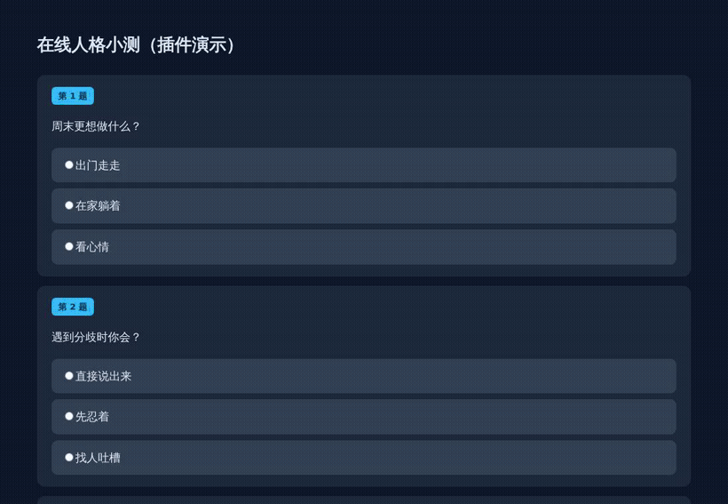

# 🌐 browser_llm_pro · LLM 浏览器 Pro

> 给 AstrBot 上的大模型一整套**能真正操作浏览器**的工具集：不止截图，还能点、拖、按键、批量答题、玩 Flash 老游戏，并把整个过程**录成带声音的视频**发出来。
>
> 让机器人自己去查资料、填表单、做在线测试、玩网页小游戏。

---

## 🌟 简介

`browser_llm_pro` 是 [AstrBot](https://github.com/Soulter/AstrBot) 的 LLM 工具插件，为 AI 装上「眼睛」和「双手」：通过 33 个 `browser_*` 工具，让大模型直接打开网页、点击、拖拽、按键、读取页面、批量作答表单，还能录屏与玩 Flash 老游戏。

它基于 [under-the-ocean/astrbot_plugin_browser_llm](https://github.com/under-the-ocean/astrbot_plugin_browser_llm) 二次开发，主要做了几件事：

- **每个用户独立的持久化浏览器实例**：各自独立 Cookie / 缓存，互不串台，突破系统 30 秒超时限制。
- **为「少往返、省 token」而设计**：动作结果直接带回截图 + 页面摘要，批量操作一次调用完成多步（每次工具往返实测 1~4 秒）。
- **补齐「能看会动还要能留证」**：录屏带声音、Flash（Ruffle）老游戏、表单一键作答。

---

## ✨ 功能特性（33 个工具）

### 🧭 导航与标签页
- **`browser_open(url)`** — 打开指定网页
- **`browser_back()` / `browser_forward()`** — 后退 / 前进
- **`browser_get_tabs()`** — 获取标签页列表
- **`browser_switch_tab(index)`** — 切换标签页
- **`browser_close_tab(index)`** — 关闭标签页
- **`browser_close()`** — 关闭当前用户的浏览器

### 🖱️ 页面交互
- **`browser_click(x, y)`** — 按截图坐标点击（插件自动换算到页面坐标）
- **`browser_click_text(text)`** — 按可见文字点击（自动滚动 + 悬停）
- **`browser_click_element(selector)`** — 按 CSS / XPath 选择器点击
- **`browser_click_canvas()`** — 点游戏画面中心「抓鼠标」
- **`browser_hover(x, y)` / `browser_hover_element(selector)`** — 悬停
- **`browser_key(key)` / `browser_key_down(key)` / `browser_key_up(key)`** — 按键 / 按住 / 松开
- **`browser_input(text)` / `browser_input_by_selector(selector, text)`** — 输入文本
- **`browser_scroll(direction, distance)`** — 滚动页面
- **`browser_zoom(scale)`** — 缩放页面
- **`browser_act(actions)`** — 一次调用连续执行多步（点击 / 按键 / 拖拽 / 等待），省往返

### 📷 读取与截图
- **`browser_screenshot()`** — 获取页面截图（图片直接带回上下文）
- **`browser_get_source(save_to_file)`** — 获取页面 HTML 源码
- **`browser_get_element_text(selector)`** — 获取元素文本
- **`browser_get_element_attribute(selector, name)`** — 获取元素属性
- **`browser_find_elements(selector)`** — 查找页面元素
- **`browser_wait_for_element(selector, timeout)`** — 等待元素出现

### 📝 表单 / 问卷
- **`browser_form()`** — 读出整页选择题 / 问卷 / 表单（纯文本，题干 + 选项）
- **`browser_answer(answers, submit_text)`** — 一次点完整页选项，可选自动提交

### 🎥 录屏（带声音）
- **`browser_record(duration)`** — 录一段固定时长的画面，生成 mp4 发给用户
- **`browser_record_start(max_duration)` / `browser_record_stop()`** — 手动开始 / 结束，边操作边录

### 🕹️ Flash（Ruffle）老游戏
- **`browser_play_swf(swf_url, base)`** — 用内置 Ruffle（WASM 版 Flash 模拟器）播放 .swf 老游戏
~~Docker内存太小会炸~~
---

## 🎬 演示



---

## 🛠️ 安装

```bash
cd /AstrBot/data/plugins
git clone https://github.com/ddxglin/browser_llm_pro.git
# 可选：Flash（SWF 老游戏）支持，会下载 Ruffle 到 vendor/ruffle/
bash browser_llm_pro/tools/fetch_ruffle.sh
```

依赖：

- **Playwright（chromium 内核）**：`pip install playwright && playwright install chromium`
- **ffmpeg**：录屏合成用（`apt install ffmpeg`）
- **PulseAudio 虚拟声卡**（仅「录屏带声音」需要）：容器里没有真实声卡也能做——加载 `module-null-sink`，浏览器通过 `PULSE_SERVER` 把声音输出进去。细节见 `core/audio.py` 与 `core/recorder.py`。

装好后在 AstrBot 面板的插件页启用即可，所有配置都在面板上，无需改代码。

---

## ⚙️ 配置

配置面板（`_conf_schema.json`）共 39 项，全部可在 AstrBot 插件页直接调整。常用项：

| 配置 | 默认 | 说明 |
|------|------|------|
| `browser_type` | `chromium` | 浏览器引擎（chromium / firefox / webkit） |
| `screenshot_max_width` | `1024` | 截图宽度，越小 token 越少、模型越快 |
| `action_screenshot` / `action_digest` | 开 | 动作结果是否附带截图 / 页面摘要（省往返的关键） |
| `zoom_factor` | `1.5` | 页面整体缩放；**canvas 游戏请设 1.0** |
| `idle_timeout` | `600` | 闲置多久回收浏览器（游戏类任务建议调大） |
| `max_memory_percent` / `mem_min_available_mb` | `80` / `900` | 内存守护：只有真实可用内存低于阈值才关浏览器，避免误杀 |
| `record_audio` | 开 | 录屏是否连页面声音一起录 |
| `record_max_duration` | `120` | 单次录屏上限（最高 300 秒） |
| `record_max_width/height` | `0` | 0 = 跟随视口，不缩放不变形 |
| `flash_ruffle` | 开 | 是否启用 Flash（Ruffle）支持 |
| `browser_proxy` | 空 | 留空自动跟随环境变量；`direct` 强制直连；或显式填代理地址 |

---

## 🔧 使用示例

### 批量操作（推荐）
```python
# 搜索框输入并回车，一次调用完成
browser_act(actions='[{"type":"click","text":"搜索框"},{"type":"text","text":"原神"},{"type":"key","key":"Enter"},{"type":"wait","ms":1000}]')
```

### 一键做选择题
```python
browser_form()                    # 读出整页题目 + 选项
browser_answer(answers='{"1":2,"2":4,"3":1}', submit_text="提交")
```

### 录屏留证
```python
browser_record(duration=20)       # 录 20 秒并直接发视频
# 或边操作边录：
browser_record_start(max_duration=60)
# ... 中间继续点击 / 滚动 ...
browser_record_stop()
```

### 玩 Flash 老游戏
```python
browser_play_swf(swf_url="https://example.com/game.swf")
browser_click_canvas()            # 抓鼠标，让游戏接管键盘
browser_key(key="ArrowRight", hold_ms=800)
```

---

## 🐛 常见问题

**录屏没有声音？**
容器里需要 PulseAudio 虚拟声卡（`module-null-sink`）。另外不能让 Chromium 带 `--mute-audio`（Playwright 默认会加，插件已用 `ignore_default_args` 处理）。

**内存被浏览器吃满？**
调低 `max_memory_percent`，或把 `idle_timeout` 调小；真实可用内存（`mem_min_available_mb`）充足时插件不会动手。

**点击没反应？**
先看返回里的页面摘要。若页面是 canvas 游戏，用 `browser_click_canvas` 抢焦点；若是表单，用 `browser_form` 看选项状态，不要靠「画面没变化」判断失败——选中往往只变一个高亮。

---

## 📋 目录结构

```
browser_llm_pro/
├─ main.py                    # AstrBot 入口：配置转换 + 传统命令
├─ browser_llm_plugin.py      # 33 个 LLM 工具定义 + 每用户实例管理
├─ metadata.yaml              # 插件元数据
├─ _conf_schema.json          # 面板配置（39 项）
├─ core/
│  ├─ browser.py              # Playwright 封装（导航/点击/拖拽/表单/截图）
│  ├─ recorder.py             # CDP 截屏流 + ffmpeg 录屏（含音频对齐）
│  ├─ audio.py                # PulseAudio 虚拟声卡与录音
│  ├─ flash.py                # Ruffle 本地服务与注入
│  ├─ supervisor.py           # 超时 / 频率限制 / 内存守护 / 闲置回收
│  ├─ reaper.py               # 孤儿浏览器与僵尸进程回收
│  ├─ operate.py              # 操作接口
│  ├─ downloader.py           # 浏览器下载器
│  ├─ favorite.py             # 收藏管理
│  └─ ticks_overlay.py        # 截图水印叠加
├─ tools/fetch_ruffle.sh      # 下载 Ruffle
├─ resource/                  # 字体等资源
└─ docs/demo-quiz.gif         # 演示动图
```

---

## 🙏 致谢与来源

- 本插件基于 [under-the-ocean/astrbot_plugin_browser_llm](https://github.com/under-the-ocean/astrbot_plugin_browser_llm) 二次开发，感谢原作者。
- Flash 模拟器：[Ruffle](https://ruffle.rs/)（Apache-2.0 / MIT，需自行下载）。
- 图标：Wikimedia Commons 的 *Internet Explorer logo for Windows 7*（CC0）。

## 📜 许可证

MIT。Ruffle 依其自身许可，需自行下载，不随仓库分发。
